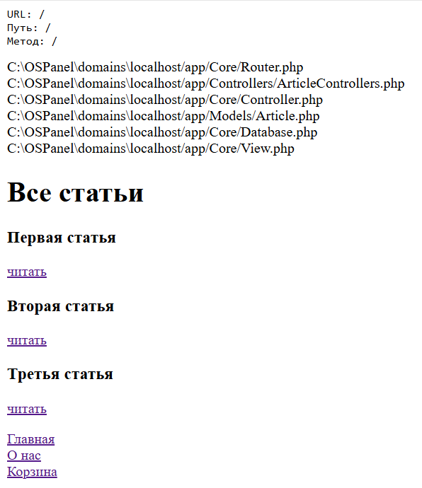
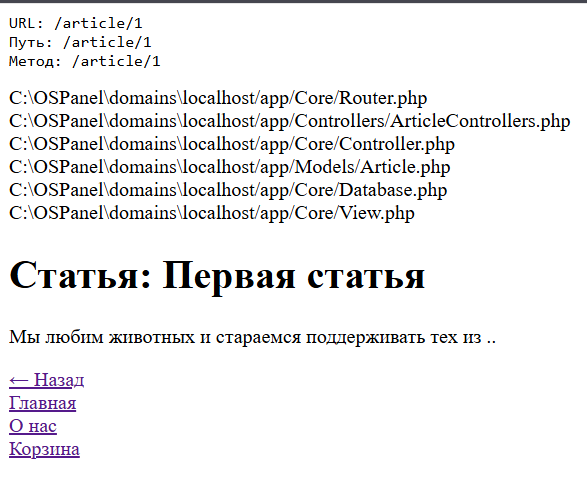

# MVC-проект: статьи на PHP

Проект по MVC написанный на паре: список статей и просмотр одной статьи. Свой роутер, контроллеры, модели и вьюхи.

Работает локально на Open Server.

---

## Что умеет

- **Главная** — показывает список всех статей из БД.
- **Страница статьи** — открывает одну статью по ID.
- **Ошибки** — красиво отдаёт 404, если статьи нет, и 400, если не передали ID.
- **Шаблонизация** — все страницы в одной обёртке (layout).

---

## Как запустить за 3 минуты

1. Склонируй репозиторий.
2. Зайди в папку: `ПР/MVC`.
3. Установи зависимости: `composer install`.
4. Положи папку в `OSPanel/domains/MVC` (или подключи домен в Open Server).
5. Открой в браузере: `http://localhost/MVC`.

Готово — можно ходить по страницам.

> Папка `vendor/` не в репозитории — она создаётся через `composer install`.

---

## Как выглядит работа проекта

Я записала, как хожу по страницам — смотри видео и скриншоты.

<video controls width="100%">
  <source src="media/demo.mp4" type="video/mp4">
</video>

---

## Что внутри (коротко)

- `App/Core/Router.php` — простой роутер: разбирает URL, ищет совпадение, вызывает нужный контроллер.
- `App/Controllers/ArticleControllers.php` — логика: получить все статьи или одну по ID, отдать в шаблон.
- `App/Models/Article.php` — запросы к БД: `SELECT * FROM articles` и поиск по ID.
- `App/Core/Database.php` — подключение к MySQL через PDO.
- `App/Core/View.php` — рендер шаблонов: берёт данные, подставляет в view, оборачивает в layout.
- `App/Views/` — HTML-шаблоны.

---

