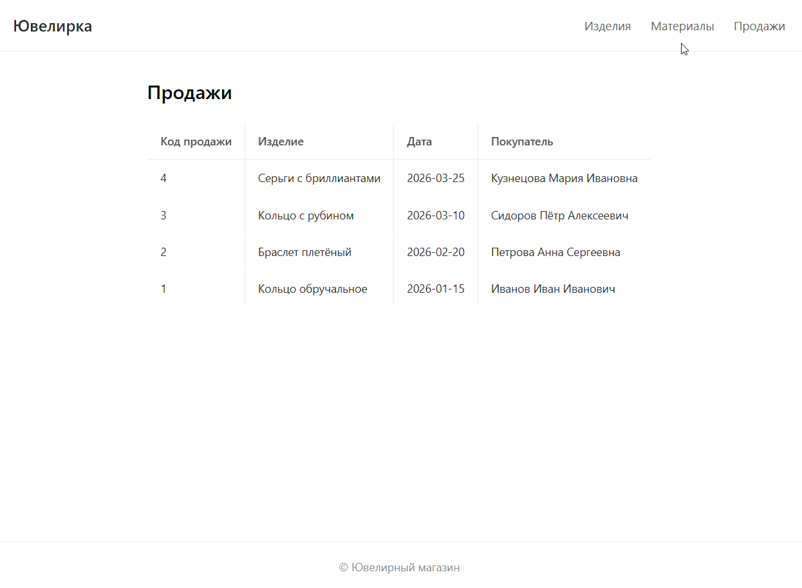

# MVC-проект: ювелирный магазин на PHP

MVC по шаблону написанного на паре. Реализованы список ювелирных изделий, просмотр одного изделия, материалы и продажи.

Работает локально на Open Server.

---

## Что умеет

- **Изделия** — показывает список всех украшений из БД вместе с материалом.
- **Страница изделия** — открывает одно изделие по ID (тип, материал, вес, цена).
- **Материалы** — список материалов с ценой за грамм.
- **Продажи** — список продаж с датой и покупателем.
- **Ошибки** — красиво отдаёт 404, если изделия нет.
- **Шаблонизация** — все страницы в одной обёртке (layout) с общим меню.

---

## Как запустить за 3 минуты

1. Склонируй репозиторий.
2. Скопируй папку проекта в `OSPanel/domains/jevelir` (или создай домен `jevelir` в настройках Open Server).
3. Настрой подключение к БД: в файле `project/config/connection.php` укажи свои данные (хост, имя БД, логин, пароль).
4. Создай базу `jewelry_shop` и таблицы в MySQL (SQL ниже).
5. Открой в браузере: `http://jevelir/products/`.

---

## Как выглядит работа проекта

В GIF показаны все переходы по страницам:



---

## Что внутри (коротко)

- `core/Router.php` — простой роутер: разбирает URL, ищет совпадение, вызывает нужный контроллер.
- `core/Dispatcher.php` — по треку находит класс контроллера и вызывает метод.
- `core/Model.php` — базовое подключение к MySQL через mysqli + методы `findOne` и `findMany`.
- `core/View.php` — рендер шаблонов: берёт данные, подставляет в view, оборачивает в layout.
- `project/controllers/` — логика: получить все изделия, одно по ID, материалы, продажи.
- `project/models/` — запросы к БД.
- `project/views/` — HTML-шаблоны.
- `project/layouts/default.php` — общая обёртка с шапкой и подвалом.

---

## Структура БД

Три таблицы: `materials`, `products`, `sales`.
Связи: `materials` (1) → (N) `products` → (N) `sales`.

```sql
CREATE DATABASE jewelry_shop CHARACTER SET utf8mb4 COLLATE utf8mb4_unicode_ci;
USE jewelry_shop;

CREATE TABLE materials (
    id INT AUTO_INCREMENT PRIMARY KEY,
    name VARCHAR(100) NOT NULL,
    price_per_gram DECIMAL(10,2) NOT NULL
);

CREATE TABLE products (
    id INT AUTO_INCREMENT PRIMARY KEY,
    name VARCHAR(150) NOT NULL,
    type VARCHAR(50) NOT NULL,
    material_id INT NOT NULL,
    weight DECIMAL(10,2) NOT NULL,
    price DECIMAL(10,2) NOT NULL,
    FOREIGN KEY (material_id) REFERENCES materials(id)
);

CREATE TABLE sales (
    id INT AUTO_INCREMENT PRIMARY KEY,
    product_id INT NOT NULL,
    sale_date DATE NOT NULL,
    buyer_name VARCHAR(200) NOT NULL,
    FOREIGN KEY (product_id) REFERENCES products(id)
);
